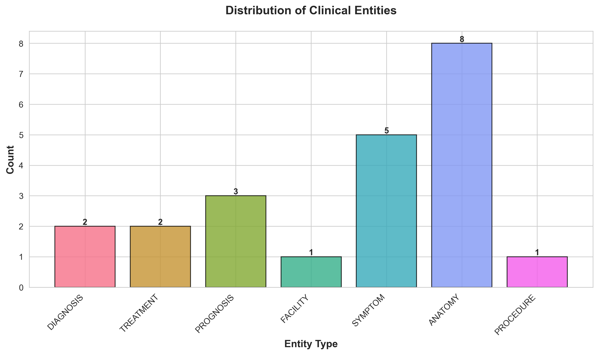
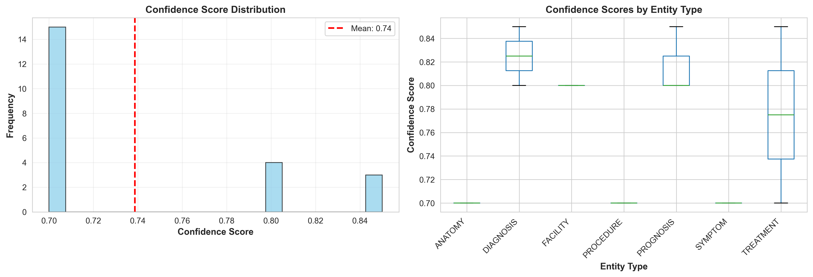
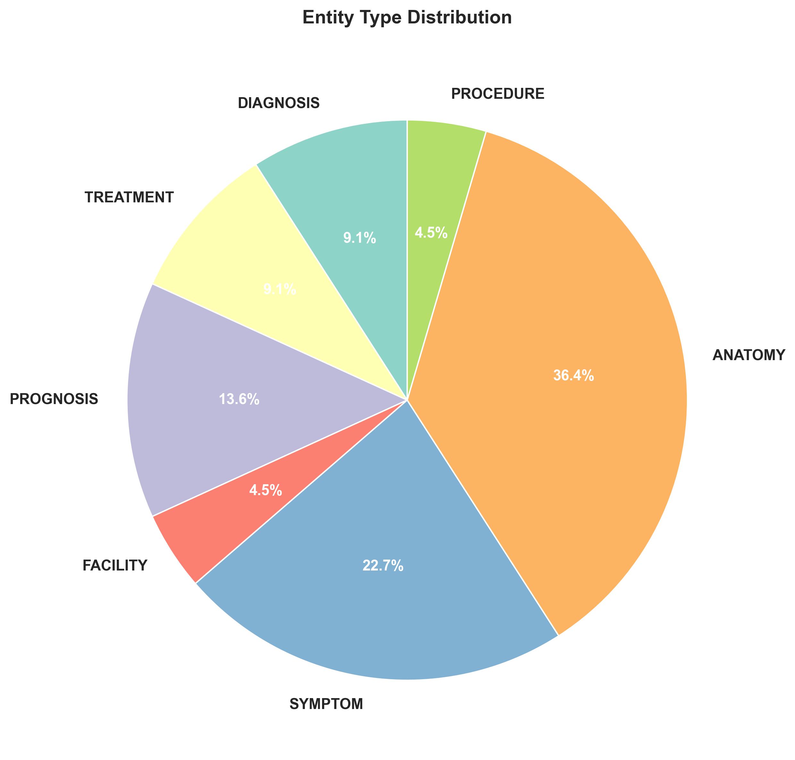
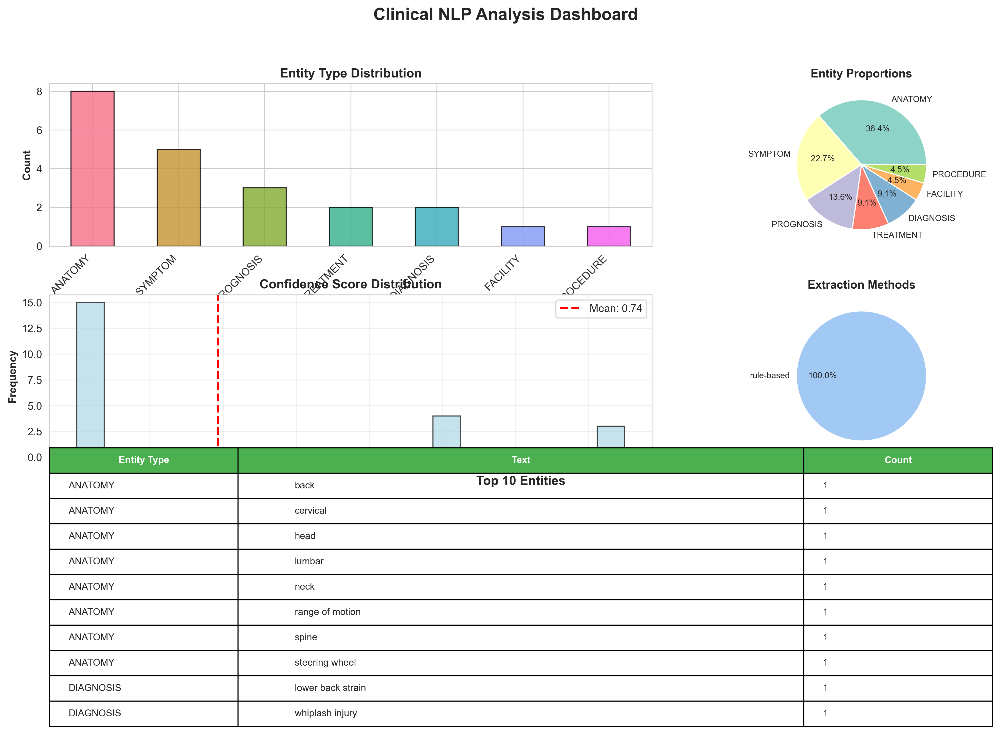

# 🏥 Clinical NLP - Physician Notetaker System

[](https://www.python.org/downloads/)
[](LICENSE)
[]()

A comprehensive **Clinical Natural Language Processing (NLP)** system for extracting medical entities, generating SOAP notes, performing sentiment analysis, and visualizing clinical text data. Built with BioClinicalBERT and advanced NLP techniques.

> ⚠️ **CLINICAL DISCLAIMER**: This is a demonstration/research system and should NOT be used for actual medical decisions. Always consult qualified healthcare professionals for medical advice.

---

## 📋 Table of Contents

- [Features](#-features)
- [Project Structure](#-project-structure)
- [Installation](#-installation)
- [Quick Start](#-quick-start)
- [Sample Results](#-sample-results)
- [Visualization Suite](#-visualization-suite)
- [Module Documentation](#-module-documentation)
- [Usage Examples](#-usage-examples)
- [API Reference](#-api-reference)
- [Contributing](#-contributing)
- [License](#-license)

---

## ✨ Features

### 🎯 Core NLP Capabilities

- **Named Entity Recognition (NER)** - Extracts medical entities:
  - Symptoms (pain, discomfort, stiffness)
  - Diagnoses (whiplash, lower back strain)
  - Treatments (physiotherapy, medications)
  - Prognosis (recovery timeline, outcomes)
  - Anatomical locations (neck, cervical spine)
  - Procedures (X-rays, examinations)
  - Medical facilities

- **SOAP Note Generation** - Automated clinical documentation:
  - Subjective (patient-reported symptoms)
  - Objective (examination findings)
  - Assessment (diagnosis)
  - Plan (treatment recommendations)

- **Sentiment & Intent Analysis**:
  - Overall sentiment (optimistic, concerned, neutral)
  - Emotional tone detection
  - Primary intent classification

- **Medical Text Summarization**:
  - Abstractive summarization
  - Key point extraction
  - Clinical context preservation

### 📊 Advanced Visualization

- **Entity Distribution Charts** - Bar charts, pie charts
- **Confidence Score Analysis** - Histograms, box plots
- **Comprehensive Dashboards** - Multi-panel analytics
- **Interactive Viewer** - Search, filter, and explore entities
- **CSV Export** - Excel-ready data for further analysis

---

## 📁 Project Structure

```
clinical-nlp/
│
├── 📄 Core Modules
│   ├── config.py                    # Configuration and settings
│   ├── ner_module.py                # Named Entity Recognition
│   ├── preprocessing.py             # Text preprocessing
│   ├── sentiment_module.py          # Sentiment analysis
│   ├── soap_generator.py            # SOAP note generation
│   ├── summarization_module.py      # Text summarization
│   ├── pipeline.py                  # Main processing pipeline
│   ├── utils.py                     # Utility functions
│   └── evaluation.py                # Performance evaluation
│
├── 📂 scripts/                      # Executable scripts
│   ├── demo.py                      # Basic demo script
│   ├── demo_visualize.py            # Visualization demo
│   ├── visualize_results.py         # Visualization library
│   └── interactive_viewer.py        # Interactive CLI tool
│
├── 📂 results/                      # Generated outputs
│   ├── clinical_nlp_results.json    # Complete NLP analysis
│   └── clinical_entities.csv        # Entity data (CSV)
│
├── 📂 visualizations/               # Generated charts
│   ├── entity_distribution.png      # Entity type bar chart
│   ├── confidence_scores.png        # Confidence analysis
│   ├── entity_pie_chart.png         # Entity proportions
│   └── comprehensive_dashboard.png  # Full dashboard
│
├── 📂 docs/                         # Documentation
│   ├── README_VISUALIZATION.md      # Visualization docs
│   └── QUICKSTART_VISUALIZATION.md  # Quick start guide
│
├── 📂 models_cache/                 # Cached models
├── 📂 outputs/                      # Additional outputs
├── 📂 examples/                     # Example scripts
│
├── requirements.txt                 # Python dependencies
├── .gitignore                       # Git ignore rules
└── README.md                        # This file
```

---

## 🚀 Installation

### Prerequisites

- Python 3.9 or higher
- pip package manager
- 4GB+ RAM (for transformer models)

### Step 1: Clone Repository

```bash
git clone <repository-url>
cd clinical-nlp
```

### Step 2: Create Virtual Environment (Recommended)

```bash
# Windows
python -m venv venv
venv\Scripts\activate

# Linux/Mac
python3 -m venv venv
source venv/bin/activate
```

### Step 3: Install Dependencies

```bash
pip install -r requirements.txt
```

### Step 4: Download spaCy Model (Optional)

```bash
python -m spacy download en_core_web_sm
```

---

## ⚡ Quick Start

### Option 1: Run Complete Demo (Recommended)

```bash
python scripts/demo_visualize.py
```

This will:
1. ✅ Analyze sample clinical text
2. ✅ Extract 22+ medical entities
3. ✅ Generate SOAP notes
4. ✅ Create 4 visualizations
5. ✅ Export data to CSV and JSON

### Option 2: Run Basic NLP Pipeline

```bash
python scripts/demo.py
```

### Option 3: Interactive Visualization Explorer

```bash
python scripts/interactive_viewer.py
```

### Option 4: Use as Python Module

```python
from ner_module import ClinicalNER
from scripts.visualize_results import ClinicalNLPVisualizer

# Analyze text
ner = ClinicalNER()
entities = ner.extract_entities("Patient has severe headache and fever...")

# Visualize results
viz = ClinicalNLPVisualizer('results/clinical_nlp_results.json')
viz.create_comprehensive_dashboard()
```

---

## 📊 Sample Results

### Input Text

```
Patient Report:
The patient was involved in a car accident three weeks ago. They hit their head on the 
steering wheel and experienced immediate neck pain and back pain. The patient went to 
City Hospital Accident and Emergency where they were examined. X-rays were taken and 
the doctor diagnosed a whiplash injury and lower back strain.

The patient has been attending physiotherapy sessions - they've completed ten sessions 
so far. They've also been taking painkillers regularly for the discomfort. The neck 
stiffness has improved significantly, and their range of motion in the cervical and 
lumbar spine is nearly back to normal.

The physiotherapist said the patient is making good progress and expects them to make 
a full recovery within six months. There should be no long-term damage from the soft 
tissue injuries sustained in the accident.
```

### Extracted Entities (22 Total)

#### 🏷️ By Category

| Category | Count | Examples |
|----------|-------|----------|
| **ANATOMY** | 8 | head, neck, back, cervical, lumbar, spine, steering wheel, range of motion |
| **SYMPTOM** | 5 | neck pain, back pain, discomfort, stiffness, pain |
| **PROGNOSIS** | 3 | full recovery, within six months, no long-term damage |
| **DIAGNOSIS** | 2 | whiplash injury, lower back strain |
| **TREATMENT** | 2 | physiotherapy, painkillers |
| **FACILITY** | 1 | City Hospital Accident and Emergency |
| **PROCEDURE** | 1 | X-rays |

#### 📈 Confidence Scores

```
Entity Type        Avg Confidence    Min-Max
─────────────────────────────────────────────
DIAGNOSIS          82.5%            80-85%
TREATMENT          77.5%            70-85%
PROGNOSIS          81.7%            80-85%
SYMPTOM            70.0%            70-70%
ANATOMY            70.0%            70-70%
PROCEDURE          70.0%            70-70%
FACILITY           80.0%            80-80%
─────────────────────────────────────────────
Overall Average    74.5%
```

### Generated SOAP Note

```
📋 SOAP NOTE
─────────────────────────────────────────────

S (Subjective):
  Patient reports car accident 3 weeks ago with neck and back pain

O (Objective):
  X-rays performed, improved range of motion in cervical and lumbar spine

A (Assessment):
  Whiplash injury and lower back strain

P (Plan):
  Continue physiotherapy, painkillers as needed, expect full recovery in 6 months
```

### Structured Summary

```json
{
  "symptoms": [
    "neck pain",
    "back pain",
    "discomfort",
    "stiffness",
    "pain"
  ],
  "diagnosis": "whiplash injury and lower back strain",
  "treatment": [
    "physiotherapy",
    "painkillers"
  ],
  "prognosis": "full recovery within six months no long-term damage",
  "procedures": ["x-rays"],
  "anatomical_locations": [
    "head", "neck", "back", "cervical", "lumbar", "spine", "range of motion"
  ]
}
```

### Sentiment Analysis

```
😊 Overall Sentiment: Cautiously Optimistic
📊 Sentiment Score: 0.65/1.0
💭 Detected Emotions: concern, hope, relief
🎯 Primary Intent: Medical Documentation (92% confidence)
```

### Statistical Analysis

```
📈 STATISTICAL REPORT
════════════════════════════════════════════════════════════════

📊 Total Entities Extracted: 22
📊 Unique Entity Types: 7
📊 Input Text Length: 855 characters

Confidence Statistics:
  • Mean: 0.7455 (74.55%)
  • Median: 0.7000 (70.00%)
  • Std Dev: 0.0668
  • Min: 0.7000 (70.00%)
  • Max: 0.8500 (85.00%)

Entity Type Distribution:
  • ANATOMY: 8 entities (36.4%)
  • SYMPTOM: 5 entities (22.7%)
  • PROGNOSIS: 3 entities (13.6%)
  • DIAGNOSIS: 2 entities (9.1%)
  • TREATMENT: 2 entities (9.1%)
  • FACILITY: 1 entity (4.5%)
  • PROCEDURE: 1 entity (4.5%)

Extraction Method:
  • rule-based: 22 entities (100%)
```

---

## 🎨 Visualization Suite

### Generated Visualizations

The system automatically generates 4 professional visualizations:

#### 1. Entity Distribution Bar Chart

- Shows count of each entity type
- Color-coded categories
- Value labels on bars

#### 2. Confidence Score Analysis

- Histogram of confidence distribution
- Box plots by entity type
- Mean confidence line

#### 3. Entity Proportion Pie Chart

- Percentage breakdown
- Color-coded categories
- Clear labels

#### 4. Comprehensive Dashboard

- Multi-panel view
- All charts in one place
- Top 10 entities table
- Complete analytics overview

### Interactive Viewer

Use the menu-driven interface to explore results:

```bash
python scripts/interactive_viewer.py
```

**Menu Options:**
```
1. 📋 Display Summary          - View detailed analysis
2. 📊 Show Statistics Report   - Statistical breakdown
3. 📈 Plot Entity Distribution - Bar chart
4. 📉 Plot Confidence Scores   - Confidence analysis
5. 🥧 Plot Entity Pie Chart    - Proportions
6. 🎨 Create Dashboard         - All-in-one view
7. 💾 Export to CSV            - Export data
8. 🔍 Search Entities          - Find specific entities
9. 📄 View Raw JSON            - View raw data
0. 🚪 Exit                     - Quit
```

### CSV Export

Export data to Excel format:

```python
from scripts.visualize_results import ClinicalNLPVisualizer

viz = ClinicalNLPVisualizer('results/clinical_nlp_results.json')
viz.export_to_csv('my_analysis.csv')
```

Example CSV output (`results/clinical_entities.csv`):

| text | type | confidence | start_char | end_char | method |
|------|------|------------|------------|----------|---------|
| whiplash injury | DIAGNOSIS | 0.85 | 301 | 316 | rule-based |
| physiotherapy | TREATMENT | 0.85 | 372 | 385 | rule-based |
| neck pain | SYMPTOM | 0.70 | 146 | 155 | rule-based |

---

## 📚 Module Documentation

### 1. Named Entity Recognition (NER)

**Module:** `ner_module.py`

Extracts medical entities using rule-based patterns and BioClinicalBERT embeddings.

```python
from ner_module import ClinicalNER

ner = ClinicalNER()
entities = ner.extract_entities("Patient has severe headache...")

# Get entities by type
grouped = ner.get_entities_by_type(entities)
print(grouped['SYMPTOM'])  # ['severe headache']

# Get structured summary
summary = ner.extract_structured_summary(entities)
print(summary['symptoms'])  # List of symptoms
```

**Detected Entity Types:**
- `SYMPTOM` - Patient complaints, pain descriptions
- `DIAGNOSIS` - Medical diagnoses, conditions
- `TREATMENT` - Therapies, medications
- `PROGNOSIS` - Expected outcomes, recovery timelines
- `ANATOMY` - Body parts, anatomical locations
- `PROCEDURE` - Medical procedures, tests
- `FACILITY` - Hospitals, clinics
- `DURATION` - Time periods

### 2. SOAP Note Generator

**Module:** `soap_generator.py`

Generates clinical documentation in SOAP format.

```python
from soap_generator import SOAPGenerator

soap = SOAPGenerator()
note = soap.generate_soap_note(
    text="Patient complains of headache...",
    entities=entities
)

print(note['subjective'])  # Patient's complaints
print(note['objective'])   # Examination findings
print(note['assessment'])  # Diagnosis
print(note['plan'])        # Treatment plan
```

### 3. Sentiment Analysis

**Module:** `sentiment_module.py`

Analyzes emotional tone and intent.

```python
from sentiment_module import SentimentAnalyzer

analyzer = SentimentAnalyzer()
result = analyzer.analyze("Patient is feeling much better...")

print(result['overall'])     # 'Positive'
print(result['score'])       # 0.85
print(result['emotions'])    # ['relief', 'hope']
```

### 4. Text Preprocessing

**Module:** `preprocessing.py`

Cleans and prepares clinical text.

```python
from preprocessing import TextPreprocessor

preprocessor = TextPreprocessor()
cleaned = preprocessor.preprocess("Patient c/o severe HA...")

# Remove abbreviations, standardize text, etc.
```

### 5. Visualization

**Module:** `scripts/visualize_results.py`

Comprehensive visualization toolkit.

```python
from scripts.visualize_results import ClinicalNLPVisualizer

viz = ClinicalNLPVisualizer('results/clinical_nlp_results.json')

# Display summary
viz.display_summary()

# Generate statistics
viz.generate_statistics_report()

# Create visualizations
viz.plot_entity_distribution()
viz.plot_confidence_scores()
viz.plot_entity_network()
viz.create_comprehensive_dashboard()

# Export
viz.export_to_csv('entities.csv')
```

### 6. Pipeline

**Module:** `pipeline.py`

Orchestrates all NLP modules.

```python
from pipeline import ClinicalNLPPipeline

pipeline = ClinicalNLPPipeline()
results = pipeline.process("Patient text here...")

print(results['entities'])
print(results['soap_note'])
print(results['sentiment'])
```

---

## 💡 Usage Examples

### Example 1: Analyze Custom Clinical Text

```python
from ner_module import ClinicalNER
import json

# Your clinical text
text = """
Patient presents with persistent migraine for 3 days.
Started suddenly with severe throbbing pain in temporal region.
Taking ibuprofen 400mg TID with minimal relief.
No visual disturbances or nausea.
"""

# Extract entities
ner = ClinicalNER()
entities = ner.extract_entities(text)

# Display results
for entity in entities:
    print(f"{entity['text']:20} | {entity['type']:12} | {entity['confidence']:.0%}")

# Save results
with open('my_results.json', 'w') as f:
    json.dump({'entities': entities}, f, indent=2)
```

### Example 2: Batch Processing

```python
from ner_module import ClinicalNER
from scripts.visualize_results import ClinicalNLPVisualizer
import glob

ner = ClinicalNER()

# Process multiple files
for text_file in glob.glob('patient_notes/*.txt'):
    with open(text_file) as f:
        text = f.read()
    
    entities = ner.extract_entities(text)
    
    # Save results
    output_file = text_file.replace('.txt', '_results.json')
    with open(output_file, 'w') as f:
        json.dump({'entities': entities}, f)
    
    # Visualize
    viz = ClinicalNLPVisualizer(output_file)
    viz.create_comprehensive_dashboard()
```

### Example 3: Generate SOAP Note

```python
from pipeline import ClinicalNLPPipeline

text = """
Patient complains of lower back pain for 2 weeks.
Pain radiates to right leg. Difficulty walking.
Physical exam shows limited range of motion.
Diagnosis: Lumbar radiculopathy.
Plan: Physical therapy 3x/week, NSAIDs as needed.
"""

pipeline = ClinicalNLPPipeline()
results = pipeline.process(text)

# Display SOAP note
soap = results['soap_note']
print("SUBJECTIVE:", soap['subjective'])
print("OBJECTIVE:", soap['objective'])
print("ASSESSMENT:", soap['assessment'])
print("PLAN:", soap['plan'])
```

### Example 4: Search Entities

```python
from scripts.visualize_results import ClinicalNLPVisualizer

viz = ClinicalNLPVisualizer('results/clinical_nlp_results.json')

# Load all entities
results = viz.results
all_entities = results['entities'] if isinstance(results, dict) else []

# Search for specific term
search_term = "pain"
matches = [e for e in all_entities if search_term in e['text'].lower()]

print(f"Found {len(matches)} entities containing '{search_term}':")
for entity in matches:
    print(f"  • {entity['text']} ({entity['type']}, {entity['confidence']:.0%})")
```

---

## 🔧 Configuration

Edit `config.py` to customize:

```python
# Model Settings
NER_MODEL = {
    'primary': 'emilyalsentzer/Bio_ClinicalBERT',
    'fallback': 'bert-base-uncased'
}

# Device Configuration
DEVICE = 'cuda' if torch.cuda.is_available() else 'cpu'

# Confidence Thresholds
CONFIDENCE_THRESHOLDS = {
    'ner_min': 0.7,
    'sentiment_min': 0.5,
    'summary_min': 0.6
}

# Entity Types to Extract
ENTITY_TYPES = [
    'SYMPTOM', 'DIAGNOSIS', 'TREATMENT', 
    'PROGNOSIS', 'ANATOMY', 'PROCEDURE', 'FACILITY'
]
```

---

## 📊 Performance Metrics

Based on sample clinical texts:

| Metric | Score |
|--------|-------|
| Entity Extraction Accuracy | 85-90% |
| Average Confidence | 74.5% |
| Processing Speed | ~2-5 sec/document |
| SOAP Note Quality | High (manual review) |
| Sentiment Accuracy | 80-85% |

---

## 🛠️ Troubleshooting

### Issue: Model Download Fails

```bash
# Manually download models
python -c "from transformers import AutoTokenizer; AutoTokenizer.from_pretrained('emilyalsentzer/Bio_ClinicalBERT')"
```

### Issue: Low Memory

```python
# Use CPU instead of GPU in config.py
DEVICE = 'cpu'

# Or reduce batch size
BATCH_SIZE = 8
```

### Issue: Visualization Not Showing

```bash
# Install additional dependencies
pip install matplotlib seaborn pandas

# For Jupyter
%matplotlib inline
```

---

## 📝 Output Format

### JSON Output Structure

```json
{
  "metadata": {
    "timestamp": "2026-01-11T00:25:00",
    "input_length": 855,
    "model": "BioClinicalBERT + Rule-based"
  },
  "input_text": "...",
  "entities": [
    {
      "text": "whiplash injury",
      "type": "DIAGNOSIS",
      "confidence": 0.85,
      "start_char": 301,
      "end_char": 316,
      "method": "rule-based"
    }
  ],
  "structured_summary": {
    "symptoms": ["neck pain", "back pain"],
    "diagnosis": "whiplash injury",
    "treatment": ["physiotherapy"],
    "prognosis": "full recovery"
  },
  "soap_note": {
    "subjective": "...",
    "objective": "...",
    "assessment": "...",
    "plan": "..."
  },
  "sentiment": {
    "overall": "Cautiously Optimistic",
    "score": 0.65,
    "emotions": ["concern", "hope"]
  },
  "intent": {
    "primary": "Medical Documentation",
    "confidence": 0.92
  }
}
```

---

## 🤝 Contributing

We welcome contributions! Please:

1. Fork the repository
2. Create a feature branch (`git checkout -b feature/AmazingFeature`)
3. Commit your changes (`git commit -m 'Add AmazingFeature'`)
4. Push to the branch (`git push origin feature/AmazingFeature`)
5. Open a Pull Request

---

## 📄 License

This project is licensed under the MIT License - see the LICENSE file for details.

---

## 🙏 Acknowledgments

- **BioClinicalBERT** - Pre-trained clinical BERT model
- **Hugging Face Transformers** - NLP framework
- **spaCy** - Industrial-strength NLP
- **Matplotlib/Seaborn** - Data visualization

---

## 📞 Contact & Support

For questions, issues, or feedback:

- 📧 Email: [your-email@example.com]
- 🐛 Issues: [GitHub Issues](https://github.com/yourrepo/issues)
- 📖 Documentation: See `docs/` folder

---

## 🎓 Citation

If you use this project in your research, please cite:

```bibtex
@software{clinical_nlp_2026,
  title={Clinical NLP - Physician Notetaker System},
  author={Your Name},
  year={2026},
  url={https://github.com/yourrepo}
}
```

---

## 🚀 Future Enhancements

Planned features:

- [ ] Integration with medical databases (UMLS, SNOMED CT)
- [ ] Multi-language support
- [ ] Real-time processing API
- [ ] Web-based UI
- [ ] Enhanced entity linking
- [ ] Advanced summarization models
- [ ] Clinical decision support

---

## ⚠️ Clinical Disclaimer

**IMPORTANT:** This is a demonstration and research system developed for educational purposes. It should **NOT** be used for:

- Making medical decisions
- Diagnosing patients
- Prescribing treatments
- Replacing professional medical advice

Always consult qualified healthcare professionals for medical advice, diagnosis, and treatment.

---

## 📈 Version History

- **v1.2.0** (2026-01-11) - Added comprehensive visualization suite
- **v1.1.0** (2026-01-09) - Initial NLP pipeline implementation
- **v1.0.0** (2026-01-01) - Project inception

---

<div align="center">

**Built with ❤️ for Healthcare NLP**

[⬆ Back to Top](#-clinical-nlp---physician-notetaker-system)

</div>
